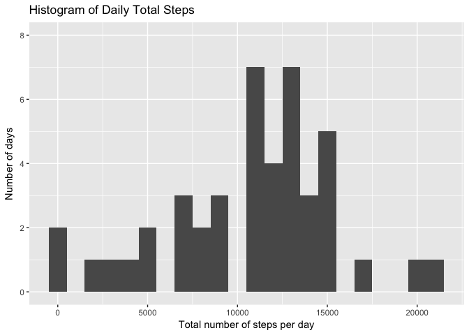
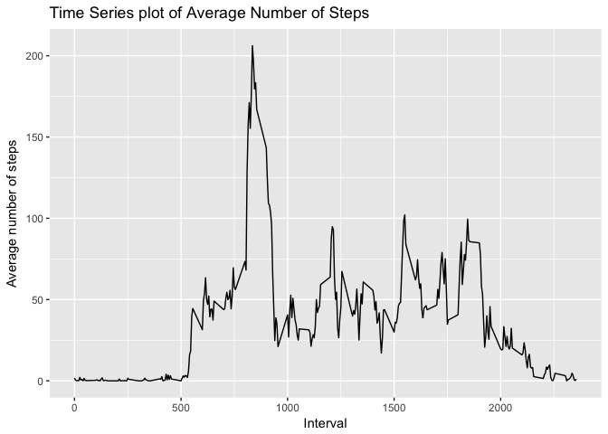
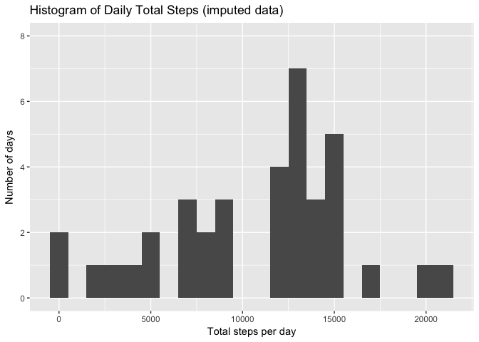
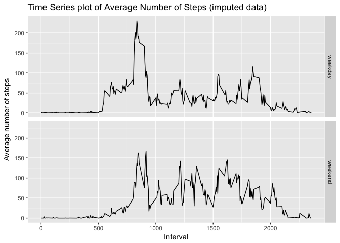

## Introduction

This assignment makes use of data from a personal activity monitoring
device. This device collects data at 5-minute intervals throughout the
day. The data consists of two months of data from an anonymous
individual collected during the months of October and November, 2012
and include the number of steps taken in 5-minute intervals each day.

The data for this assignment can be found in this repo in the **activity.zip** file.

The variables included in this dataset are:

* **steps**: Number of steps taking in a 5-minute interval (missing
    values are coded as `NA`);  
* **date**: The date on which the measurement was taken in YYYY-MM-DD
    format;  
* **interval**: Identifier for the 5-minute interval in which
    measurement was taken.

The dataset is stored in a comma-separated-value (CSV) file and there
are a total of 17,568 observations in this dataset.

## Loading and preprocessing the data

First, let's load the required libraries.


```r
library(tidyverse)
library(lubridate)
```

Then, we read in the activities dataset. And we convert the **date** variable from class *Factor* to class *Date*.


```r
unzip("activity.zip")
df <- read.csv("activity.csv")
df$date <- ymd(df$date)
```

## What is the mean total number of steps taken per day?

For each day, we compute the total number of steps taken that day.


```r
daily_totals_df <- df %>%
    group_by(date) %>%
    summarise(total = sum(steps))
```

This is the corresponding histogram:


```r
ggplot(daily_totals_df, aes(total)) +
    geom_histogram(binwidth = 1000) +
    ggtitle("Histogram of Daily Total Steps") +
    xlab("Total number of steps per day") +
    ylab("Number of days") +
    ylim(0, 8)
```

<!-- -->

Then, we compute the mean and median of the total number of steps per day.


```r
(mean <- mean(daily_totals_df$total, na.rm = TRUE))
```

```
## [1] 10766.19
```

```r
(median <- median(daily_totals_df$total, na.rm = TRUE))
```

```
## [1] 10765
```

The **mean** total number of steps taken per day is: 10766.19.  
The **median** total number of steps taken per day is: 10765.

## What is the average daily activity pattern?

For each interval, we calculate the average number of steps taken, averaged across all days. Then, we create a time series plot, using ggplot2.


```r
interval_means_df <- df %>%
    group_by(interval) %>%
    summarise(average = mean(steps, na.rm = TRUE))

ggplot(interval_means_df, aes(interval, average)) +
    geom_line() +
    ggtitle("Time Series plot of Average Number of Steps") +
    xlab("Interval") +
    ylab("Average number of steps")
```

<!-- -->

Let's compute the 5-minute interval that, on average across all the days in the dataset, contains the maximum number of steps.


```r
max <- interval_means_df[which.max(interval_means_df$average), ]
(max_interval <- max$interval)
```

```
## [1] 835
```

```r
(max_steps <- round(max$average, digits = 2))
```

```
## [1] 206.17
```

The maximum of the average number of steps per interval is: 206.17.  
The corresponding interval is 835.

## Imputing missing values


```r
na_rows <- is.na(df$steps)
sum(na_rows)
```

```
## [1] 2304
```

The data has 2304 missing values.

For a given interval with a missing value, we replace the missing value with the average for that interval over all days.

To do this, we first define a function **get_interval_mean**:


```r
get_interval_mean <- function(x) {
    interval_means_df[interval_means_df$interval == x, ]$average
}
```

Then, we create a new, imputed dataset. For every row that has a missing value, we use the function we created in the previous step.


```r
df_new <- df
for (i in seq_along(na_rows)) {
    if (na_rows[i])
        df_new[i, ]$steps <- get_interval_mean(df_new[i, ]$interval)
}
```

Just like before, for each day, we compute the total number of steps taken that day.


```r
daily_totals_df_new <- df_new %>%
    group_by(date) %>%
    summarise(total = sum(steps))
```

This is the histogram of the daily totals for the imputed data:


```r
ggplot(daily_totals_df_new, aes(total)) +
    geom_histogram(binwidth = 1000) +
    ggtitle("Histogram of Daily Total Steps (imputed data)") +
    xlab("Total steps per day") +
    ylab("Number of days") +
    ylim(0, 8)
```

<!-- -->

Now, we compute the mean and median of the total number of steps per day, for the imputed data.


```r
(mean_new <- mean(daily_totals_df_new$total, na.rm = TRUE))
```

```
## [1] 10766.19
```

```r
(median_new <- median(daily_totals_df_new$total, na.rm = TRUE))
```

```
## [1] 10766.19
```

The **mean** total number of steps taken per day in the imputed dataset is: 10766.19.  
The **median** total number of steps taken per day in the imputed dataset is: 10766.19.

Note that:

* the unimputed and imputed data have the same mean total number of steps taken per day;
* for the imputed data, the mean and median have the same value.

So, imputing the data in this way does not change the mean total number of steps per day. However, it does change the median.

## Are there differences in activity patterns between weekdays and weekends?

Let's create a new factor variable in the dataset with two levels -- *"weekday"* and *"weekend"* -- indicating whether a given date is a weekday or weekend day.


```r
df_new$day_type <- as.factor(ifelse(wday(df_new$date) %in% c(1, 7), "weekend", "weekday"))
```

Finally, we make a panel plot containing a time series plot (using ggplot2) of the interval and the average number of steps taken, averaged across all weekday days or weekend days.


```r
interval_means_df_new <- df_new %>%
    group_by(day_type, interval) %>%
    summarise(average = mean(steps, na.rm = TRUE))

ggplot(interval_means_df_new, aes(interval, average)) +
    geom_line() +
    ggtitle("Time Series plot of Average Number of Steps (imputed data)") +
    xlab("Interval") +
    ylab("Average number of steps") +
    facet_grid(day_type ~ .)
```

<!-- -->

On weekdays, we notice a big spike in the morning. Also on weekdays, the average number of steps taken per interval varies more and has higher spikes, compared to weekend days.
